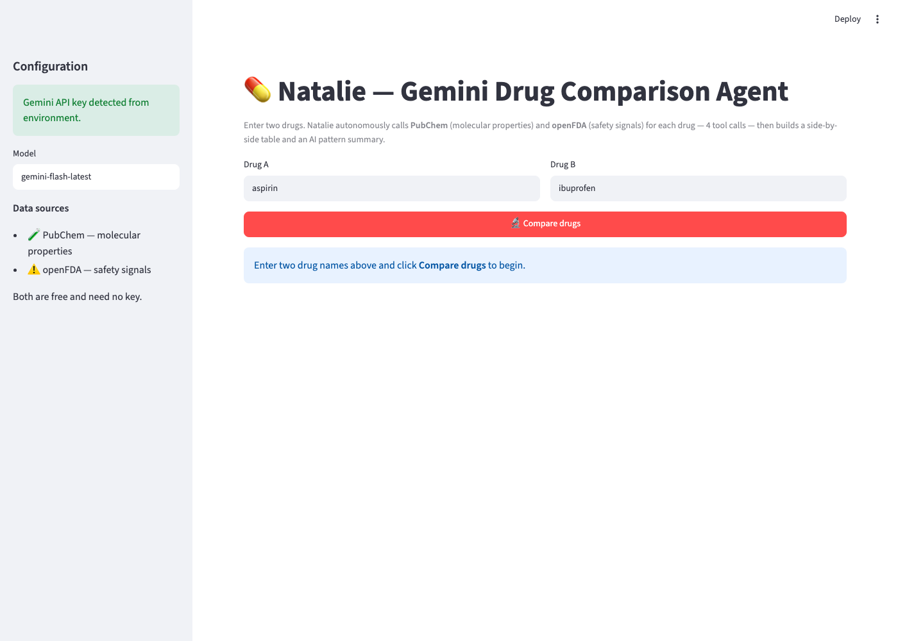
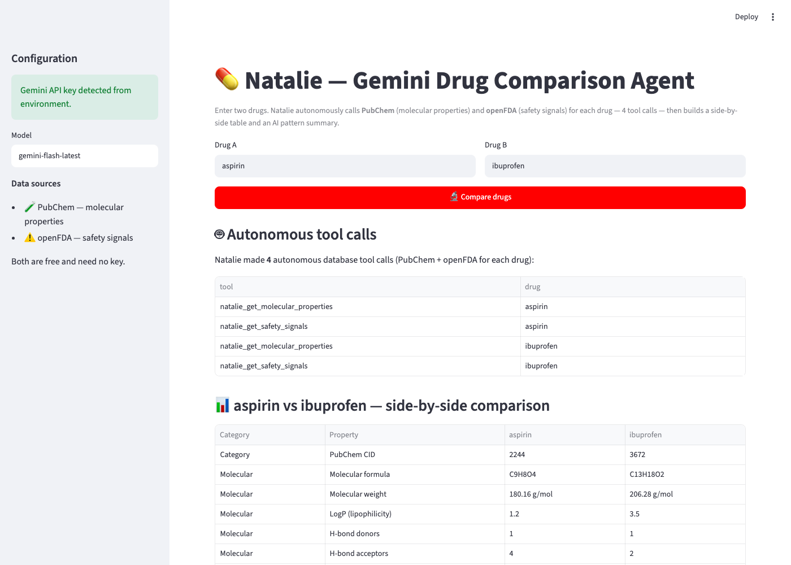
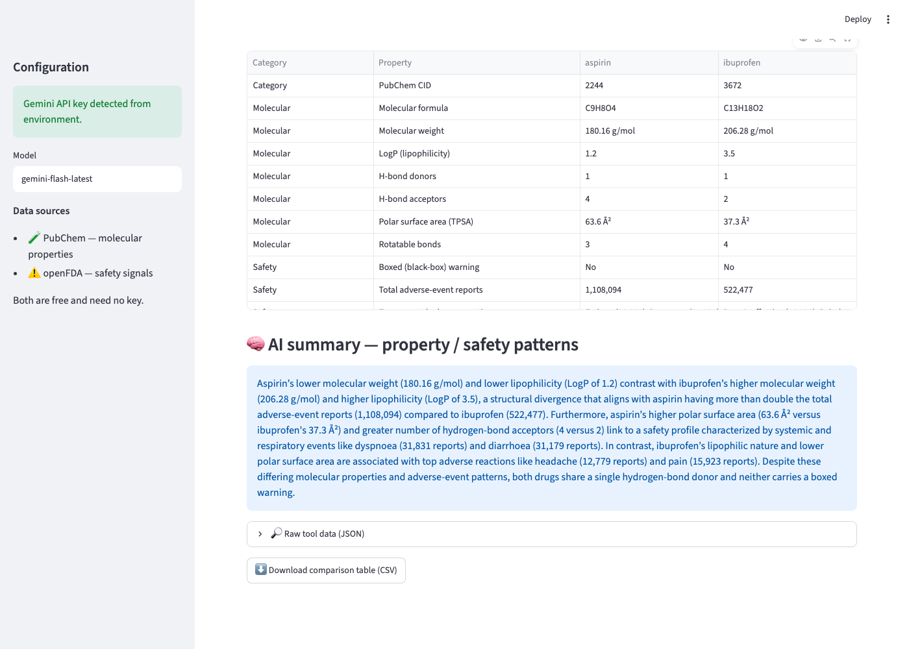

# 💊 Natalie — Gemini Drug Comparison Agent

Natalie is an AI agent, powered by **Google Gemini**, that takes **two drug
names** and produces a structured comparison of their **molecular properties**
and **safety signals**, plus an AI-written summary of the patterns linking the
two.

For every comparison the agent **autonomously calls two database tools for each
drug** (2 tools × 2 drugs = **4 tool calls**) via Gemini function calling, then
assembles the returned data into a side-by-side table.

---

## What it produces

1. **Side-by-side comparison table** of molecular properties (PubChem) and
   safety signals (openFDA).
2. **3–5 sentence AI summary** identifying property↔safety patterns.
3. A **web UI** (Streamlit) with a downloadable CSV of the table.
4. **Documented example runs** in [`natalie_examples.md`](./natalie_examples.md).

### The two database tools (called autonomously per drug)

| Tool | Source | Returns |
|------|--------|---------|
| `natalie_get_molecular_properties(drug)` | **PubChem** PUG REST | Formula, molecular weight, LogP, H-bond donors/acceptors, TPSA, rotatable bonds |
| `natalie_get_safety_signals(drug)` | **openFDA** | Top adverse reactions (with counts), boxed-warning flag, total reports, warnings excerpt |

Both sources are free and require **no API key**. Only Gemini needs a key.

---

## Screenshots

**1. Landing page** — enter two drugs; the agent's key/model/data-sources are shown in the sidebar.



**2. Autonomous tool calls + comparison table** — Natalie reports the 4 database tool calls it made, then the assembled side-by-side table.



**3. AI summary** — a 3–5 sentence summary connecting molecular properties to safety signals.



---

## Quick start

### 1. Add your Gemini API key

Get a free key at <https://aistudio.google.com/apikey>, then put it in `.env`:

```
GEMINI_API_KEY=your_key_here
```

(A template is in `.env.example`. The default model is `gemini-flash-latest`,
a stable alias that always maps to a current Gemini Flash model.)

### 2. Run everything with one command

```bash
./natalie_run.sh
```

This creates a virtual environment, installs dependencies, runs the two
documented example comparisons (writing `natalie_examples.md`), and launches the
web app at <http://localhost:8501>.

### Individual commands

```bash
./natalie_run.sh setup                       # create venv + install deps only
./natalie_run.sh app                         # launch the Streamlit web app
./natalie_run.sh examples                    # regenerate natalie_examples.md
./natalie_run.sh compare aspirin ibuprofen   # one-off CLI comparison
```

---

## How it works (architecture)

```
                 ┌─────────────────────────────────────────────┐
   two drugs ──▶ │  NatalieAgent.compare(drug_a, drug_b)        │
                 │                                              │
                 │  1. Gemini function-calling loop             │
                 │     Gemini autonomously decides to call:     │
                 │       natalie_get_molecular_properties(A)    │──▶ PubChem
                 │       natalie_get_safety_signals(A)          │──▶ openFDA
                 │       natalie_get_molecular_properties(B)    │──▶ PubChem
                 │       natalie_get_safety_signals(B)          │──▶ openFDA
                 │                                              │
                 │  2. Capture the real tool results and build  │
                 │     the structured side-by-side table        │
                 │     (numbers come straight from the tools —  │
                 │      never hallucinated)                     │
                 │                                              │
                 │  3. Gemini writes the 3–5 sentence summary   │
                 │     from the verified table                  │
                 └─────────────────────────────────────────────┘
                                  │
                                  ▼
                   table + summary + tool-call log
```

Design note: Gemini genuinely performs the tool calls (autonomous function
calling), but the **table cells are filled from the captured tool outputs**, not
from model free-text — so every value in the table is real data. Gemini is then
asked to summarize only that verified table.

---

## Files

| File | Purpose |
|------|---------|
| `natalie_tools.py` | The two database tools (PubChem + openFDA) |
| `natalie_agent.py` | The Gemini agent: function-calling loop, table builder, summary |
| `natalie_app.py` | Streamlit web UI |
| `natalie_examples.py` | Generates the documented example runs |
| `natalie_screenshot.py` | Captures the README screenshots (Playwright) |
| `natalie_run.sh` | One-command runner |
| `natalie_examples.md` | Output: documented example runs |
| `.env` / `.env.example` | Gemini API key configuration |
| `requirements.txt` | Python dependencies |

---

## Example runs

See [`natalie_examples.md`](./natalie_examples.md) for full documented runs
(aspirin vs ibuprofen, acetaminophen vs naproxen), each showing the 4 autonomous
tool calls, the comparison table, and the AI summary. Try your own with:

```bash
./natalie_run.sh compare warfarin heparin
```

---

## Disclaimer

Natalie is an educational / research tool. openFDA adverse-event counts reflect
*reporting volume*, not causation or incidence, and are heavily influenced by how
widely a drug is used. Nothing here is medical advice.
